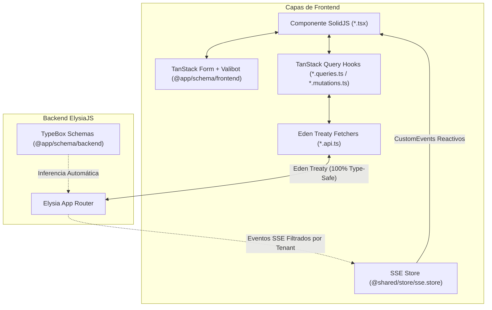

# 🚀 GUÍA DE CONSUMO Y ARQUITECTURA FRONTEND (SolidJS + Eden Treaty + Valibot + TanStack)

Esta guía documenta los estándares oficiales para consumir APIs, manejar estados, validar formularios y sincronizar eventos en tiempo real en el frontend con **100% de inferencia estricta de tipos de TypeScript**.

---

## 📑 TABLA DE CONTENIDOS
1. [Arquitectura General y Flujo de Datos](#1-arquitectura-general-y-flujo-de-datos)
2. [Pilar 1: Consumo de APIs con Eden Treaty](#2-pilar-1-consumo-de-apis-con-eden-treaty)
3. [Pilar 2: Caché y Estado Asíncrono con TanStack Query](#3-pilar-2-caché-y-estado-asíncrono-con-tanstack-query)
4. [Pilar 3: Validación de Formularios con TanStack Form & Valibot](#4-pilar-3-validación-de-formularios-con-tanstack-form--valibot)
5. [Pilar 4: Tiempo Real y Eventos SSE](#5-pilar-4-tiempo-real-y-eventos-sse)
6. [Pilar 5: Control de Acceso (RBAC) y Multi-Tenancy](#6-pilar-5-control-de-acceso-rbac-y-multi-tenancy)
7. [Resumen de Importaciones por Capa](#7-resumen-de-importaciones-por-capa)

---

## 1. Arquitectura General y Flujo de Datos



---

## 2. Pilar 1: Consumo de APIs con Eden Treaty

El cliente Eden Treaty (`@shared/lib/eden`) infiere **automáticamente** los tipos de todas las rutas de ElysiaJS: parámetros de URL, querystrings, cuerpos de petición y tipos de respuesta.

### 📌 Patrón Oficial: Capa `*.api.ts`

Crea siempre un archivo `[modulo].api.ts` para encapsular las llamadas de Eden:

```typescript
// frontend/src/modules/users/data/users.api.ts
import { api } from '@shared/lib/eden';
import { throwApiError } from '@shared/utils/api-errors';
import type { UsersFilters } from '@app/schema/dto';

export const usersApi = {
    // GET con Query Parameters tipados
    listUsers: async (filters: UsersFilters = {}) => {
        const { data, error } = await api.rbac.users.get({
            query: {
                search: filters.search,
                page: filters.page,
                limit: filters.limit,
                sortBy: filters.sortBy,
                sortOrder: filters.sortOrder,
                isActive: filters.isActive?.join(','),
                roles: filters.roles?.join(','),
            },
        });
        if (error) throwApiError(error);
        return data!; // Tipado automáticamente como PaginatedResult<UserListItemType>
    },

    // GET por ID de ruta
    getUserById: async (id: number) => {
        const { data, error } = await api.rbac.users({ id }).get();
        if (error) throwApiError(error);
        return data!; // Tipado automáticamente como UserDetailType
    },

    // POST con Body inferido de TypeBox
    createUser: async (body: Parameters<typeof api.rbac.users.post>[0]) => {
        const { data, error } = await api.rbac.users.post(body);
        if (error) throwApiError(error);
        return data!;
    },

    // DELETE
    deleteUser: async (id: number) => {
        const { data, error } = await api.rbac.users({ id }).delete();
        if (error) throwApiError(error);
        return data!;
    },
};
```

---

## 3. Pilar 2: Caché y Estado Asíncrono con TanStack Query

### 📌 A. Query Keys Estructuradas (`*.keys.ts`)

```typescript
// frontend/src/modules/users/data/users.keys.ts
export const rbacKeys = {
    all: ['rbac'] as const,
    roles: () => [...rbacKeys.all, 'roles'] as const,
    role: (id: number) => [...rbacKeys.roles(), id] as const,
    users: () => [...rbacKeys.all, 'users'] as const,
    userList: (filters?: Record<string, unknown>) => [...rbacKeys.users(), 'list', filters] as const,
    userDetail: (id: () => number) => [...rbacKeys.users(), 'detail', id()] as const,
};
```

### 📌 B. Hooks de Consulta Reactivos (`*.queries.ts`)

En SolidJS, los parámetros de las queries deben ser **funciones accesores (getters reactivos)**:

```typescript
// frontend/src/modules/users/data/users.queries.ts
import { createQuery, keepPreviousData } from '@tanstack/solid-query';
import { rbacKeys } from './users.keys';
import { usersApi } from './users.api';
import type { UsersFilters } from '@app/schema/dto';

export function useUsersList(filters: () => UsersFilters) {
    return createQuery(() => ({
        queryKey: rbacKeys.userList(filters()),
        queryFn: () => usersApi.listUsers(filters()),
        placeholderData: keepPreviousData, // Evita parpadeos al paginar
        staleTime: 1000 * 60 * 2,          // 2 minutos de caché fresco
    }));
}
```

### 📌 C. Mutations con Invalidación de Caché (`*.mutations.ts`)

```typescript
// frontend/src/modules/users/data/users.mutations.ts
import { createMutation, useQueryClient } from '@tanstack/solid-query';
import { toast } from 'solid-sonner';
import { rbacKeys } from './users.keys';
import { usersApi } from './users.api';

export function useCreateUser() {
    const queryClient = useQueryClient();

    return createMutation(() => ({
        mutationFn: usersApi.createUser,
        onSuccess: () => {
            toast.success('Usuario creado exitosamente');
            queryClient.invalidateQueries({ queryKey: rbacKeys.users() });
        },
        onError: (err: any) => {
            toast.error(err?.message || 'Error al crear usuario');
        },
    }));
}
```

---

## 4. Pilar 3: Validación de Formularios con TanStack Form & Valibot

Todos los esquemas de formulario se importan exclusivamente desde `@app/schema/frontend`.

```tsx
// frontend/src/modules/users/components/UserCreateForm.tsx
import { Component } from 'solid-js';
import { createForm } from '@tanstack/solid-form';
import { valibotValidator } from '@tanstack/valibot-form-adapter';
import { UserCreateSchema, type UserCreateData } from '@app/schema/frontend';
import { useCreateUser } from '../data/users.mutations';
import Input from '@/shared/ui/form/Input';
import Button from '@/shared/ui/form/Button';

export const UserCreateForm: Component<{ onSuccess?: () => void }> = (props) => {
    const createMutation = useCreateUser();

    const form = createForm(() => ({
        defaultValues: {
            username: '',
            email: '',
            password: '',
            roleIds: [] as number[],
            entityId: null as number | null,
        } as UserCreateData,
        validatorAdapter: valibotValidator(),
        validators: {
            onChange: UserCreateSchema, // Valida reactivamente en cada cambio
        },
        onSubmit: async ({ value }) => {
            await createMutation.mutateAsync(value);
            props.onSuccess?.();
        },
    }));

    return (
        <form
            onSubmit={(e) => {
                e.preventDefault();
                e.stopPropagation();
                form.handleSubmit();
            }}
            class="space-y-4"
        >
            <form.Field name="username">
                {(field) => (
                    <div>
                        <label class="block text-sm font-medium text-slate-700 dark:text-slate-300">
                            Usuario
                        </label>
                        <Input
                            value={field().state.value}
                            onInput={(e) => field().handleChange(e.currentTarget.value)}
                            onBlur={field().handleBlur}
                            placeholder="jdoe"
                        />
                        {field().state.meta.errors.length > 0 && (
                            <p class="text-xs text-rose-500 mt-1">
                                {field().state.meta.errors[0]?.message}
                            </p>
                        )}
                    </div>
                )}
            </form.Field>

            <form.Subscribe
                selector={(state) => ({
                    canSubmit: state.canSubmit,
                    isSubmitting: state.isSubmitting,
                })}
            >
                {(state) => (
                    <Button
                        type="submit"
                        disabled={!state().canSubmit || state().isSubmitting}
                        loading={state().isSubmitting}
                    >
                        Guardar Usuario
                    </Button>
                )}
            </form.Subscribe>
        </form>
    );
};
```

---

## 5. Pilar 4: Tiempo Real y Eventos SSE

La infraestructura de SSE (`useSSE()`) se conecta automáticamente al servidor y aísla las salas por empresa.

### 📌 Suscripción y Revalidación de Caché en Componentes

```tsx
import { Component, onMount, onCleanup } from 'solid-js';
import { useQueryClient } from '@tanstack/solid-query';
import { useSSE } from '@shared/store/sse.store';
import { RealtimeEvents } from '@app/schema/realtime-events';
import { rbacKeys } from '../data/users.keys';

export const UsersLiveTable: Component = () => {
    const queryClient = useQueryClient();
    const { subscribe, unsubscribe } = useSSE();

    onMount(() => {
        // 1. Suscribirse a la sala de usuarios (el backend la aísla como company:{id}:users)
        subscribe('users');

        // 2. Manejador para invalidar TanStack Query automáticamente
        const handleUserChange = (event: Event) => {
            const customEvt = event as CustomEvent;
            console.log('⚡ Evento recibido:', customEvt.type, customEvt.detail);
            queryClient.invalidateQueries({ queryKey: rbacKeys.users() });
        };

        // 3. Escuchar los eventos del dominio
        window.addEventListener(RealtimeEvents.USER.CREATED, handleUserChange);
        window.addEventListener(RealtimeEvents.USER.UPDATED, handleUserChange);
        window.addEventListener(RealtimeEvents.USER.DELETED, handleUserChange);

        // 4. Limpieza automática al desmontar la vista
        onCleanup(() => {
            unsubscribe('users');
            window.removeEventListener(RealtimeEvents.USER.CREATED, handleUserChange);
            window.removeEventListener(RealtimeEvents.USER.UPDATED, handleUserChange);
            window.removeEventListener(RealtimeEvents.USER.DELETED, handleUserChange);
        });
    });

    return <div>...</div>;
};
```

---

## 6. Pilar 5: Control de Acceso (RBAC) y Multi-Tenancy

### 📌 A. Comprobación de Roles y Permisos (`auth.store.ts`)

```tsx
import { Show, type Component } from 'solid-js';
import { useAuth } from '@modules/auth/store/auth.store';

export const ActionToolbar: Component = () => {
    const { hasPermission, hasRole, user } = useAuth();

    return (
        <div class="flex gap-2">
            {/* Mostrar botón solo si tiene permiso de creación */}
            <Show when={hasPermission('users.create')}>
                <button class="btn btn-primary">Nuevo Usuario</button>
            </Show>

            {/* Mostrar sección especial solo para superadmin */}
            <Show when={hasRole('superadmin')}>
                <div class="badge badge-warning">Modo Administrador Global</div>
            </Show>
        </div>
    );
};
```

### 📌 B. Branding Dinámico del Inquilino (`branding.store.ts`)

```tsx
import { Component } from 'solid-js';
import { useBranding } from '@modules/auth/store/branding.store';

export const TenantHeader: Component = () => {
    const branding = useBranding();

    return (
        <header class="flex items-center gap-3">
            {branding.logoUrl() && (
                
            )}
            <h1 class="font-bold text-lg">{branding.businessName()}</h1>
        </header>
    );
};
```

---

## 7. Resumen de Importaciones por Capa

| Propósito | Módulo a Importar | Ejemplo |
| :--- | :--- | :--- |
| **API Client** | `@shared/lib/eden` | `import { api } from '@shared/lib/eden';` |
| **Queries / Mutations** | `@tanstack/solid-query` | `import { createQuery, createMutation } from '@tanstack/solid-query';` |
| **Form Engine** | `@tanstack/solid-form` + adapter | `import { createForm } from '@tanstack/solid-form';` |
| **Form Schemas & Types** | `@app/schema/frontend` | `import { UserFormSchema, type UserFormData } from '@app/schema/frontend';` |
| **API DTO Contracts** | `@app/schema/dto` (o `@app/schema/backend`) | `import type { UserListItemType, RoleType } from '@app/schema/dto';` |
| **Realtime Events** | `@app/schema/realtime-events` + SSE | `import { RealtimeEvents } from '@app/schema/realtime-events';` |
| **Auth & RBAC State** | `@modules/auth/store/auth.store` | `import { useAuth } from '@modules/auth/store/auth.store';` |
| **Tenant Branding** | `@modules/auth/store/branding.store` | `import { useBranding } from '@modules/auth/store/branding.store';` |
